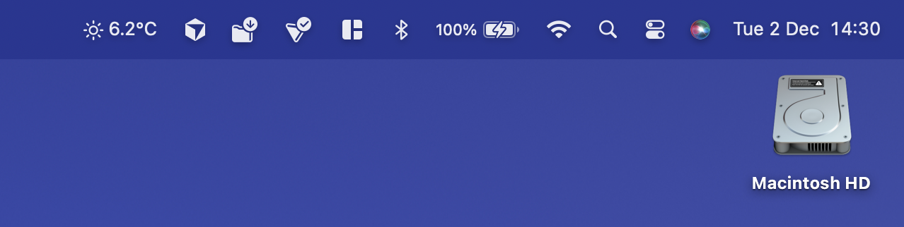
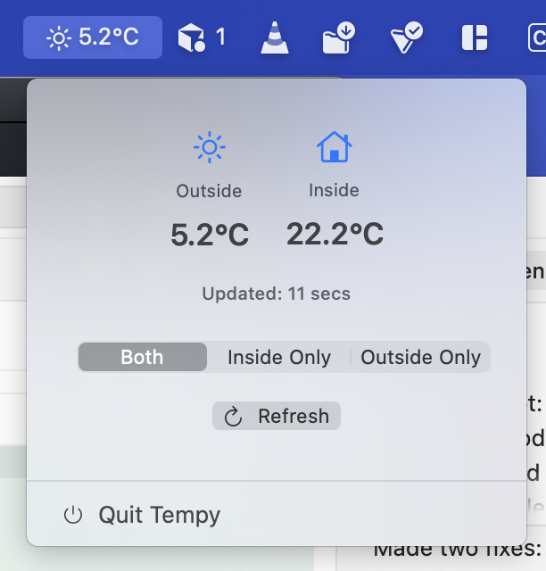

#  Tempy

A macOS menu bar app that displays temperature readings from Shelly BLU H&T sensors. Shows inside and outside temperatures directly in your menu bar.





## Features

- Real-time temperature display in menu bar
- Toggle between inside and outside temperature views
- Auto-refreshes every 60 seconds
- Clean, minimal interface
- Dark mode support

## Requirements

- macOS 15.7 or later
- Xcode 15.0 or later
- Swift 5.0+
- Backend API endpoint (Cloudflare Worker included)

## Quick Start

### 1. Set Up Backend

First, deploy the Cloudflare Worker backend:

```bash
cd backend/cloudflare-worker
npm install -g wrangler
wrangler login
wrangler secret put SHELLY_AUTH_KEY
wrangler secret put SHELLY_INSIDE_DEVICE_ID
wrangler secret put SHELLY_OUTSIDE_DEVICE_ID
wrangler deploy
```

See [backend/README.md](./backend/README.md) for detailed backend setup instructions.

### 2. Configure macOS App

1. Clone the repository:
   ```bash
   git clone https://github.com/YOUR_USERNAME/tempy.git
   cd tempy
   ```

2. Update the API endpoint:
   - Open `Tempy/TemperatureService.swift`
   - Replace `apiURLString` with your Cloudflare Worker URL

3. Build and run:
   ```bash
   open Tempy.xcodeproj
   ```
   - Press `Cmd + R` to build and run
   - Or use: `./build.sh`

## Usage

- Click the menu bar item to open the popup
- Use the segmented control to switch between "Inside Only" and "Outside Only"
- Click "Refresh" to manually update temperatures
- Click "Quit Tempy" to exit

## Project Structure

```
Tempy/
├── Tempy/                      # macOS app source code
│   ├── TempyApp.swift          # App entry point
│   ├── ContentView.swift       # Popup window
│   ├── TemperatureService.swift # API client
│   ├── TemperatureData.swift   # Data models
│   ├── DisplayModeManager.swift # Preferences
│   └── DisplayPreference.swift # Display modes
├── backend/                    # Backend implementation
│   ├── cloudflare-worker/      # Cloudflare Worker (recommended)
│   └── examples/              # Example frontend code
└── Tempy.xcodeproj/            # Xcode project
```

## Backend Setup

The app requires a backend API that returns temperature data. A complete Cloudflare Worker implementation is included in `backend/cloudflare-worker/`.

**Required API format:**
```json
{
  "inside": 22.3,
  "outside": 4.6
}
```

See [backend/README.md](./backend/README.md) for:
- Complete setup instructions
- Alternative backend options
- Security best practices
- Troubleshooting

## License

MIT License

